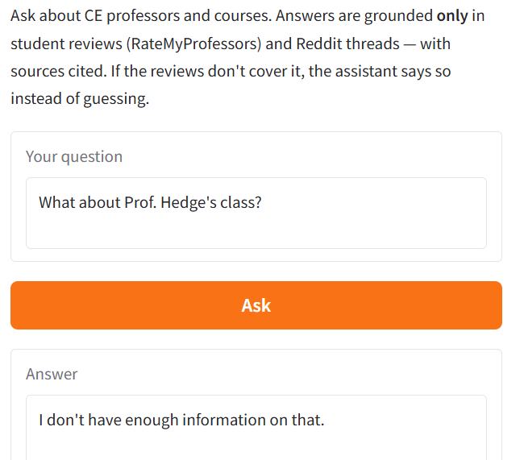

# The Unofficial Guide — Project 1

> **How to use this template:**
> Complete each section *after* you've built and tested the corresponding part of your system.
> Do not write placeholder text — if a section isn't done yet, leave it blank and come back.
> Every section below is required for submission. One-liners will not receive full credit.

---

## Domain

<!-- What topic or category of knowledge does your system cover?
     Why is this knowledge valuable, and why is it hard to find through official channels?
     Example: "Student reviews of CS professors at [university] — useful because official
     course descriptions don't reflect teaching style, exam difficulty, or workload." -->

This knowledge is valuable because official channels tell you *what* a course covers, not *what it's like to take it* — the real workload, grading fairness, organization, and teaching quality. It's hard to find officially because NYU doesn't publish candid evaluations, and the honest signal is scattered across separate review pages and long Reddit threads. A RAG system collapses that into one searchable, attributable answer.

---

## Document Sources

<!-- List every source you collected documents from.
     Be specific: include URLs, subreddit names, forum thread titles, or file names.
     Aim for variety — sources that together cover different subtopics or perspectives. -->

| # | Source | Type | URL or file path |
|---|--------|-------------|-----------------|
| 1 | RateMyProfessors 1 | pdf | documents/01_rmp_amit_patel.pdf |
| 2 | RateMyProfessors 2| pdf| documents/02_rmp_fraida_fund.pdf |
| 3 | RateMyProfessors 3|pdf | documents/03_rmp_azeez_bhavnagarwala.pdf |
| 4 | RateMyProfessors 4|pdf| documents/04_rmp_chinmay_hegde.pdf |
| 5 | RateMyProfessors 5| pdf| documents/05_rmp_yi_fang.pdf |
| 6 | RateMyProfessors 6| pdf| documents/06_rmp_nina_krikorian.pdf |
| 7 |RateMyProfessors 7 |pdf| documents/07_rmp_mike_wilkes.pdf |
| 8 |RateMyProfessors  8| pdf| documents/08_rmp_garrett_rose.pdf |
| 9 | Reddit 9|pdf| documents/09_reddit_awful_quality_of_education_tandon.pdf |
| 10 | Reddit 10| pdf | documents/10_reddit_worries_about_tandon.pdf |

---

## Chunking Strategy

<!-- Describe your chunking approach with enough specificity that someone else could reproduce it.
     Include:
     - Chunk size (characters or tokens) and why that size fits your documents
     - Overlap size and why (or why not) you used overlap
     - Any preprocessing you did before chunking (e.g., stripping HTML, removing headers)
     - What your final chunk count was across all documents -->

**Chunk size:** ~800 characters maximum per chunk, produced by a recursive character splitter (`ingest.py`). The splitter tries to break on the largest natural separator first — blank line (`\n\n`), then newline (`\n`), then sentence (`. `), then space — and only falls back to a hard character split when a single piece still exceeds 800 chars. In practice most chunks land well under the cap (min 56, max 796, **avg 247 chars**) because they map to single reviews/comments.

**Overlap:** ~100 characters. When adjacent small pieces are merged up to the size limit, the merger carries the last ~100 characters of the previous chunk forward, so context that straddles a boundary isn't lost.

**Why these choices fit your documents:** The corpus is short, self-contained units — individual RateMyProfessors reviews and Reddit comments — not long-form prose. Before chunking I preprocess each PDF: extract text with `pdfplumber`, rejoin pdfplumber's soft line-wraps (which otherwise break sentences mid-word), strip the `Source:` URL line out into metadata, and reconstruct one *record* per review (RMP) or per post/comment (Reddit), prefixing each with the professor's name so the chunk stays self-contained. Because records are split on record boundaries first, most reviews stay whole in a single chunk; only unusually long comments get split. An 800/100 setting comfortably holds a typical review without merging unrelated ones, while the modest overlap protects the occasional review long enough to span two chunks. A much smaller chunk would fragment single reviews; a much larger one would blend multiple distinct opinions into one vector and blur retrieval.

**Final chunk count:** **64 chunks** across the 10 documents (40 from RateMyProfessors, 24 from Reddit), saved to `data/chunks.json`.

---

## Embedding Model

<!-- Name the embedding model you used and explain your choice.
     Then answer: if you were deploying this system for real users and cost wasn't a constraint,
     what tradeoffs would you weigh in choosing a different model?
     Consider: context length limits, multilingual support, accuracy on domain-specific text,
     latency, and local vs. API-hosted. -->

**Model used:** `all-MiniLM-L6-v2` (Sentence-Transformers), run locally via ChromaDB's `SentenceTransformerEmbeddingFunction` (`search.py`). The same model embeds both the stored chunks and the query at search time, so the vectors are comparable, and retrieval uses cosine similarity (`hnsw:space: cosine`) over the persisted Chroma collection with top-k = 5. I chose it because it's free, runs locally with no API key or per-call cost, is fast on CPU, and its 384-dim embeddings are well suited to the short, single-review/comment chunks this corpus is made of. Its input window also comfortably covers our ~800-character chunks.

**Production tradeoff reflection:** If cost weren't a constraint and this served real users, I'd weigh a larger or API-hosted model (e.g. OpenAI `text-embedding-3-large` or a bigger `bge`/`e5` model) against MiniLM. The gains: higher retrieval accuracy on domain-specific phrasing (professor nicknames, course codes, the slang in Reddit threads that MiniLM can embed weakly), a longer context window so I wouldn't have to chunk as aggressively, and stronger multilingual support if reviews appeared in other languages. The costs: API-hosted embeddings add per-call latency and a network dependency, ongoing cost, and a privacy consideration (sending user queries off-machine); they also tie reproducibility to a vendor. For this project's small, English, short-text corpus, MiniLM's accuracy is more than adequate and the local/free/low-latency properties win — but at real scale I'd A/B the retrieval quality of a hosted model before committing, since the embedding model is the hardest component to swap later (changing it requires re-embedding the entire index).

---

## Grounded Generation

<!-- Explain how your system enforces grounding — how does it prevent the LLM from answering
     beyond the retrieved documents?
     Describe both your system prompt (what instruction you gave the model) and any structural
     choices (e.g., how you formatted the context, whether you filtered low-relevance chunks).
     Do not just say "I told it to use the documents" — show the actual instruction or explain
     the mechanism. -->

**System prompt grounding instruction:** Grounding is enforced in the system prompt (`app.py`), not merely suggested. The model is told to follow these rules *without exception*: (1) answer using **only** the information in the CONTEXT, with no outside or prior knowledge and no guessing or inferring facts the context doesn't state; (2) if the CONTEXT is insufficient, reply with *exactly* the sentence `I don't have enough information on that.` and nothing else; (3) never invent professor names, ratings, quotes, or facts not in the CONTEXT; (4) represent reviews faithfully and present both sides when they disagree; (5) do **not** write its own "Sources" section, because attribution is added programmatically. Generation runs at `temperature=0` so the model can't drift creatively away from the context. Structurally, the retrieved chunks are handed to the model as numbered, source-tagged context blocks (`[1] (source: …)`), and the user message ends with "Answer using only the CONTEXT above," reinforcing the boundary. The exact refusal string is also matched in code: if the answer starts with "I don't have enough information," we normalize it to the canonical refusal and attach no sources.

**How source attribution is surfaced in the response:** Sources are built **programmatically from the retrieved chunks' own metadata**, not generated by the LLM (which is explicitly told not to cite). After generation, `_collect_sources()` walks the retrieved chunks, dedupes their source documents (preserving retrieval order), and formats each as a human-readable label (the document `title`, falling back to the source id) plus its `url` when available. The Gradio UI then shows these in a separate "Retrieved from (sources)" box, bulleted, alongside the answer. Because attribution is derived from metadata rather than the model's text, it's guaranteed and traceable even if the model omits or hallucinates a citation — and on a refusal (or empty query) the source list is deliberately left empty, so we never attach sources to a non-answer.

---

## Evaluation Report

<!-- Run your 5 test questions from planning.md through your system and record the results.
     Be honest — a partially accurate or inaccurate result that you explain well is more
     valuable than a suspiciously perfect result. -->

| # | Question | Expected answer | System response (summarized) | Retrieval quality | Response accuracy |
|---|----------|-----------------|------------------------------|-------------------|-------------------|
| 1 | What do students say about Amit Patel's attendance policy? | Very strict — being even 5 minutes late counts as an absence; "old school," emailed mandating attendance or points deducted. | Reported he is "extremely strict about attendance," "five minutes late is counted as absence," "mandates attendance and timeliness," seen as "old school" for grad students, and emailed warning points would be deducted for not attending. | Relevant | Accurate |
| 2 | Is Fraida Fund's course a heavy workload, and who is it suited for? | Yes — very heavy (homework, labs, hard exams); "RUN! DON'T TAKE IT UNLESS YOU ARE A SENIOR SDE." Comprehensive/excellent but high difficulty. | Said the course has a heavy workload (homework, labs, difficult exams), is "excellent" with "amazing lectures" to some, but others warn it suits only seniors with time, quoting "RUN! DON'T TAKE IT UNLESS YOU ARE A SENIOR SDE AND HAVE LOTS OF TIME." | Relevant | Accurate |
| 3 | What are the main complaints about Chinmay Hegde's grading? | Unclear and harsh — points deducted for requirements never listed on the sheet; a system that "pits students against each other." | Listed: (1) unclear grading standards/criteria, (2) harsh grading with points deducted for unlisted requirements, (3) a system that discourages collaboration by pitting students against each other, (4) lost marks for minor issues (e.g., no graph when a table was given). | Relevant | Accurate |
| 4 | According to the Reddit thread, what specific complaints do students raise about the quality of education at Tandon? | Subpar instruction not worth ~$31k/sem tuition; disengaged profs, poorly structured content, unfair rubric-less grading, dismissive responses; quality mediocre and varies. | Listed 7 complaints: poor instruction quality, poorly structured content, classes not reflecting the high tuition, disengaged professors, unfair grading, unresponsive/dismissive professors, and mediocre quality that varies a lot. | Relevant | Accurate (omits the OP's A→F anecdote and named standout-professor counterpoints, but those go beyond "complaints") |
| 5 | What concerns do prospective students raise about attending Tandon, and how do current students respond? | Worries: mediocre profs, weaker/less-theoretical curriculum than CAS, low top-company internship odds, reputation hurting jobs. Students reassure on all four. | Gave 4 concerns (mediocre professors, mediocre curriculum, low odds of top-company internships, reputation hindering jobs) plus current-student responses: check RateMyProfessor; curriculum is standard/fulfills an engineering curriculum though less theory-based than CAS; Tandon has networking events and is scouted by Microsoft; ~half the profs aren't "NYU caliber" but some departments (math) are good; top-company internships happen (one got one after two weeks); the NYU name helps. Cited both Reddit threads. | Relevant | Accurate |

**Retrieval quality:** Relevant 
**Response accuracy:** Accurate 

All five questions retrieved on-topic chunks and produced grounded, source-cited answers; representation was faithful and two-sided where reviews disagreed (Q5). As an additional grounding check, an out-of-scope question ("What is the best dining hall at NYU?") was correctly refused with the canonical `I don't have enough information on that.` and no sources attached.

### Test screenshots

**Q1 — Amit Patel's attendance policy** (source: Amit Patel, RateMyProfessors)

**Q2 — Fraida Fund's workload** (source: Fraida Fund, RateMyProfessors)

**Q3 — Chinmay Hegde's grading** (source: Chinmay Hegde, RateMyProfessors)

**Q4 — Quality-of-education complaints** (source: Reddit r/nyu, "Awful Quality of Education at Tandon")

**Q5 — Prospective-student concerns and responses** (sources: both Reddit r/nyu threads)

**Out-of-scope refusal — "What is the best dining hall at NYU?"** (correctly declined)

---

## Failure Case Analysis

<!-- Identify at least one question where retrieval or generation did not work as expected.
     Write a specific explanation of *why* it failed, tied to a part of the pipeline.

     "The answer was wrong" is not an explanation.

     "The relevant information was split across a chunk boundary, so retrieval returned
     only half the context — the model didn't have enough to answer correctly" is an explanation.

     "The embedding model treated the professor's nickname as out-of-vocabulary and returned
     results from an unrelated review" is an explanation. -->

**Question that failed:** "What about Prof. Hedge's class?" — I misspelled Chinmay Hegde's name as "Hedge," one letter off. His reviews are in my data (18 chunks), so the system should have found them.

**What the system returned:** It refused — "I don't have enough information on that." — even though it had plenty on Hegde. Retrieval pulled the wrong professors (all Garrett Rose, plus a John Sterling comment); no Hegde chunk appeared, and the closest match was 0.508, just past my ~0.5 "good match" line. Spelled correctly, his reviews come back at ~0.48.

**Root cause (tied to a specific pipeline stage):** The embedding/retrieval step. all-MiniLM-L6-v2 splits "Hedge" into different sub-word tokens than "Hegde," so the query lands far from his chunks. Retrieval only compares meaning and never checks the name or filters on the `professor` metadata I store, so a one-letter typo detaches the query from the right document before generation runs.

**What you would change to fix it:** Don't rely on semantics alone — pull the professor's name from the question, fuzzy-match it to my professor list, and filter the search by `professor` metadata. Add hybrid (keyword + embedding) search so a near-correct surname still counts, and gate on distance so weak matches refuse instead of risking a wrong-professor answer.

---

## Spec Reflection

<!-- Reflect on how planning.md shaped your implementation.
     Answer both questions with at least 2–3 sentences each. -->

**One way the spec helped you during implementation:**
It halped me by creating clear structure for the project. This allowed me to understend the requirements of the project and make my prompts for Claude better. 

**One way your implementation diverged from the spec, and why:**
I originally planned to use the URLs for my RAG system. However, this would really complicate the system as sometimes it failed to retreieve info from some URLs and returned no access messages
---

## AI Usage

<!-- Describe at least 2 specific instances where you used an AI tool during this project.
     For each: what did you give the AI as input, what did it produce, and what did you
     change, override, or direct differently?

     "I used Claude to help me code" is not sufficient.
     "I gave Claude my Chunking Strategy section from planning.md and asked it to implement
     chunk_text(). It returned a function using a fixed character split. I overrode the
     chunk size from 500 to 200 because my documents are short reviews, not long guides." -->

**Instance 1**

- *What I gave the AI:* My chunking plan (recursive splitter, ~800 chars with ~100 overlap) and a sample PDF, and asked it to write the script that reads the PDFs and splits them into chunks.
- *What it produced:* `ingest.py` — code that extracts text from each PDF, cleans it, and splits it into ~800-character chunks saved with source metadata.
- *What I changed or overrode:* It used LangChain's built-in splitter. I told it to write the splitting logic by hand instead, so I didn't have to install LangChain/torch, and I made it keep each review as its own chunk.

**Instance 2**

- *What I gave the AI:* My retrieval and generation code, and asked it to stress-test the system — run a mix of questions (normal ones, edge cases, misspelled names, and out-of-scope ones) and show me where it broke.
- *What it produced:* A rundown of each query with its top retrieved chunks and distance scores. Two things stood out: the grounding held up (out-of-scope and weak matches got refused instead of answered), but retrieval was shaky on misspelled professor names.
- *How I used the output to improve:* I used the distance scores to sanity-check my ~0.5 relevance cutoff and confirmed in the Groq UI that the refusal actually fires on a bad match. The misspelling result is what I built my failure analysis around, and it's why my next fix is name-aware retrieval (matching the professor name before the search).
